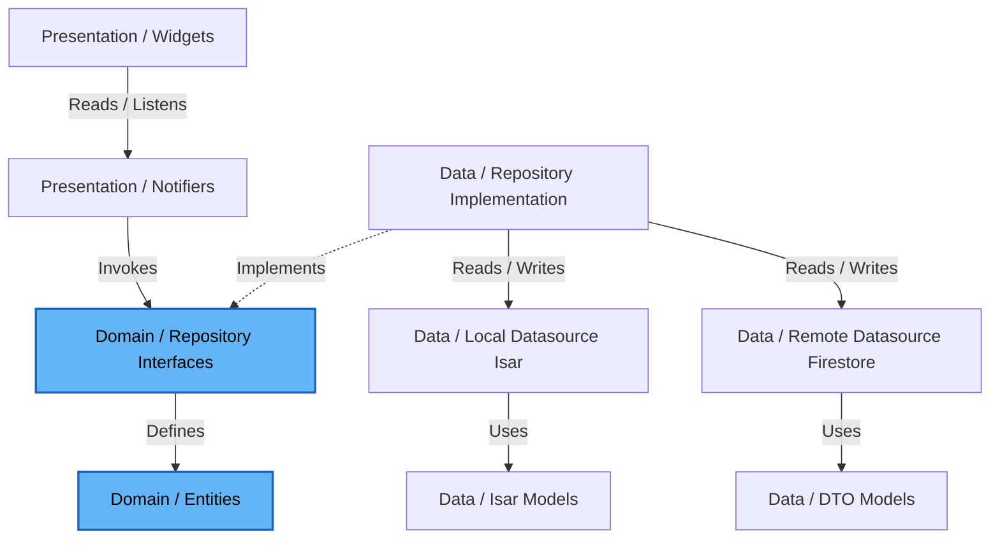
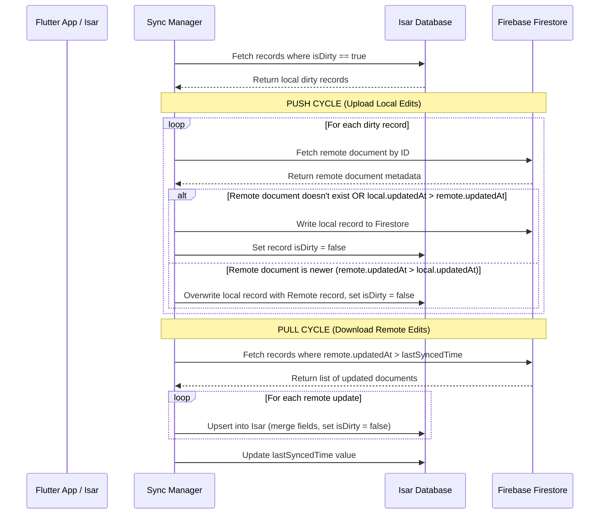

# Technical Architecture: AttendIQ

AttendIQ is structured as a Clean Architecture application organized in a Feature-First directory layout. It uses Riverpod for state management and dependency injection, and incorporates a background synchronization engine to support its offline-first capability.

---

## 1. Directory Structure

We use a **Feature-First** structure. Each directory in `lib/features/` represents a self-contained feature containing its own presentation, domain, and data layers. Shared infrastructure and utilities live in `lib/core/`.

```
lib/
├── core/                         # Shared core infrastructure
│   ├── database/                 # Isar DB helper, opening/closing connections
│   ├── theme/                    # Color palettes, typography, theme notifier
│   ├── sync/                     # Sync engine, outbox handlers, sync worker
│   ├── network/                  # Internet connection checker, client wrappers
│   ├── widgets/                  # Reusable UI elements (custom buttons, inputs)
│   ├── errors/                   # Failure classes, exceptions
│   └── utils/                    # Math formulas, Date/Time extensions
│
├── features/                     # Feature directories
│   ├── auth/                     # Authentication & onboarding flow
│   ├── subject/                  # Subject CRUD, credit settings, targets
│   ├── attendance/               # Attendance logging (Present, Absent, Late)
│   ├── timetable/                # Weekly schedule, slots, notifications
│   ├── analytics/                # Trends, forecasts, bunk calculator page
│   └── ai_advisor/               # Gemini AI assistant client & suggestions
│
└── main.dart                     # Application entry point
```

Within each **feature folder** (e.g., `lib/features/subject/`), the following layers must be strictly maintained:

```
subject/
├── data/
│   ├── datasources/             # Local (Isar) and Remote (Firestore) sources
│   │   ├── subject_local_data_source.dart
│   │   └── subject_remote_data_source.dart
│   ├── models/                  # Isar schemas, DTOs, JSON converters
│   │   ├── subject_isar_model.dart
│   │   └── subject_firestore_dto.dart
│   └── repositories/            # Repository implementations mapping data to domain
│       └── subject_repository_impl.dart
│
├── domain/
│   ├── entities/                # Pure Dart business models (Plain Old Dart Objects)
│   │   └── subject.dart
│   ├── repositories/            # Interface definitions for repositories
│   │   └── subject_repository.dart
│   └── usecases/                # Specific business operations (optional, only if complex logic exists)
│       └── calculate_subject_stats.dart
│
└── presentation/
    ├── controllers/             # Riverpod Notifiers managing UI state
    │   └── subject_list_controller.dart
    ├── pages/                   # Full screens
    │   ├── subject_list_page.dart
    │   └── subject_detail_page.dart
    └── widgets/                 # Feature-specific widgets (SubjectCard, etc.)
        └── subject_progress_bar.dart
```

---

## 2. Layers & Dependency Rules

Following Clean Architecture principles, **dependencies must only point inward**:
- The **Presentation** layer depends on the **Domain** layer (to invoke business logic) and uses **Core** for UI blocks.
- The **Data** layer depends on the **Domain** layer (implementing Repository interfaces, mapping Models to Entities).
- The **Domain** layer is completely independent of other layers. It contains no references to Flutter packages, Isar, Firebase, or HTTP clients. It is pure Dart.



---

## 3. State Management & Data Flow

Riverpod is used as the application's reactive engine. 
- **Notifiers** (`Notifier` or `AsyncNotifier` from Riverpod Generator) read repository instances, call async methods, update their state, and notify subscribers.
- **UI Widgets** consume Notifiers using `ref.watch()`. When state transitions (e.g., from loading to success), the UI automatically rebuilds.

### Standard Data Read Flow
1. Widget does `ref.watch(subjectListControllerProvider)`.
2. The controller gets the repository instance (injected via a Riverpod provider).
3. The repository queries Isar database locally.
4. The local models are converted into domain entities.
5. The list of entities is emitted as the state (`AsyncData([Subject])`).
6. Widget builds and renders the lists.

### Standard Write Flow (Offline-First)
1. User taps "Mark Present" on a class widget.
2. Widget calls `ref.read(attendanceControllerProvider.notifier).markAttendance(subjectId, AttendanceStatus.present)`.
3. The controller calls `attendanceRepository.logAttendance(record)`.
4. The Repository writes the record into **Isar local database** immediately, setting `isDirty = true` and updating `updatedAt = DateTime.now()`.
5. The Repository triggers the background sync loop asynchronously.
6. The user interface updates immediately because Isar's local stream broadcasts the updated list.

---

## 4. Offline-First Sync Engine

The sync engine ensures data consistency between Isar and Firestore. It works as an outbox queue that process tasks asynchronously.

### 4.1 Sync Architecture Components
- **Sync Envelope**: Every local model contains:
  - `updatedAt`: Unix timestamp of the last local update.
  - `isDeleted`: Tombstone flag indicating deleted records.
  - `isDirty`: Flag indicating if local changes are not yet synced.
- **Connectivity Listener**: Listens to internet connection changes. If connection is restored, it triggers the sync cycle.
- **Sync Worker**: A background worker (using Workmanager on Android/iOS) that runs periodic sync tasks and listens to remote changes.

### 4.2 Sync Cycle Sequence
When a sync starts, the following flow occurs:



### 4.3 Tombstoning (Deletes)
If a user deletes a record (e.g., deletes a Subject):
1. Locally, the repository calls `isar.writeTxn(() => subject.isDeleted = true, subject.isDirty = true)`.
2. During the next sync cycle, the deleted record is pushed to Firestore.
3. Firestore writes the document with `isDeleted = true` (or deletes it permanently, depending on backend arch).
4. Once successfully synced (Firestore responds with success), the record is permanently removed from the local Isar database to save space.
