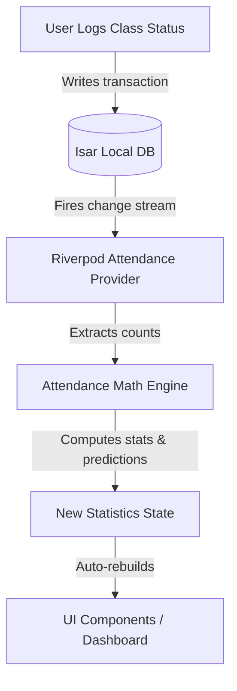

# Attendance Engine Architecture: AttendIQ

The Attendance Engine is the core computational module of AttendIQ. It handles the math formulas, schedules background event generation, parses raw log events, and manages the state propagation cycle.

---

## 1. Dynamic State & Computation Flow

The Attendance Engine operates as a unidirectional reactive loop. The local database (Isar) acts as the single source of truth. When a user interacts with the app, the data flows as follows:



1. **Write Phase**: The user records attendance (e.g. swipes "Present" on the Today View). The repository writes the state change (`status = "present"`, `isDirty = true`, `updatedAt = DateTime.now()`) to Isar.
2. **Observation Phase**: Riverpod watches the Isar collections using a reactive query stream (`isar.attendanceRecords.watchLazy()`).
3. **Calculation Phase**: Upon detecting a database write, the Riverpod provider fetches all non-deleted logs for the semester and feeds them into the `AttendanceMath` utility.
4. **Render Phase**: The updated calculations are emitted to all listening UI pages, animating progress bars, safe bunk badges, and forecasting charts instantly.

---

## 2. Timetable-to-Event Generation Design

Rather than dynamically evaluating the timetable template at runtime (which is CPU-intensive and prone to date-calculation errors), AttendIQ uses a **rolling pre-generation mechanism** to create discrete `AttendanceRecord` rows in the database.

### 2.1 The Event Generator (`AttendanceEventGenerator`)
When a weekly timetable is configured (e.g., "Math on Mondays 9:00 - 10:00 AM"), it acts as a template. The application must generate individual physical check-in events in the database for each day the class occurs.

*   **State of a Generated Event**: All auto-generated records are created with `status = "unlogged"`.
*   **Exclusion**: Records with status `"unlogged"` are excluded from the current attendance percentage calculation, but they are highlighted on the Dashboard with a warning badge until resolved.

### 2.2 Generation Triggers
To prevent database bloating (e.g. generating thousands of future events), the generator creates records in a **rolling 14-day window** (7 days in the past to catch missed logs, and 7 days in the future to allow forward planning).

```
                      [ Start of Onboarding / App Boot ]
                                      │
                                      ▼
                   [ Check: Has Semester Date Range Changed? ]
                                      │
         ┌────────────────────────────┴────────────────────────────┐
         ▼ Yes                                                     ▼ No
[ Purge future unlogged;                                   [ Read Last Run Date ]
  Regenerate whole semester range ]                                │
                                                                   ▼
                                                       [ Range: Min(LastRun, Today-7) ]
                                                       [ To: Today+7 ]
                                                                   │
                                                                   ▼
                                                      [ Check each day in range ]
                                                                   │
                                           ┌───────────────────────┴───────────────────────┐
                                           ▼ Slot Match?                                   ▼ No
                                 [ Check Isar for record ]                              [ Skip ]
                                           │
                        ┌──────────────────┴──────────────────┐
                        ▼ Record Exists?                      ▼ No
                     [ Skip ]                     [ Insert: status = unlogged ]
                                                              │
                                                              ▼
                                                    [ Save Run Date to SharedPreferences ]
```

1.  **Trigger A (Semester Setup/Timetable Edit)**:
    When a semester is first created, or when the weekly timetable template is updated, the generator scans the entire semester date range and inserts `unlogged` records for all matching slot dates, avoiding overwrites of already logged items.
2.  **Trigger B (Daily App Launch)**:
    On app startup, the generator checks the current date. If `Today` has progressed past the `LastRunDate`, it calculates the date delta and generates `unlogged` events for the upcoming rolling window `[Today, Today + 7 days]` and checks for any missed days in `[Today - 7 days, Today]`.

---

## 3. Detailed Mathematics & Calculations

### 3.1 Attendance Percentage Calculation
Calculates the current actual attendance percentage of a subject.

Let:
- $A_p$ = Number of classes marked **Present**.
- $A_a$ = Number of classes marked **Absent**.
- $A_l$ = Number of classes marked **Late**.
- $W_l$ = Late attendance weight constant (adjustable in Settings from $0.0$ to $1.0$. Default is $1.0$, which counts late as present).
- $A_e$ = Number of classes marked **Extra Class** (counted as Present).
- $A_{ea}$ = Number of classes marked **Extra Class Absent** (counted as Absent).

$$P = \left( \frac{A_p + A_e + (A_l \times W_l)}{A_p + A_a + A_l + A_e + A_{ea}} \right) \times 100$$

*Boundary Cases:*
*   If total counted classes ($A_{total} = A_p + A_a + A_l + A_e + A_{ea}$) is $0$, returns $100\%$ (perfect attendance by default on day one).
*   **Cancelled** and **Unlogged** classes are ignored.

### 3.2 Safe Bunk Calculation ($B_{safe}$)
Calculates how many consecutive future classes a student can skip (bunk) without their percentage dropping below the target threshold $T$ (e.g. 75%).

Let $A_{att}$ be the weighted attended classes count:
$$A_{att} = A_p + A_e + (A_l \times W_l)$$

$$B_{safe} = \left\lfloor \frac{100 \times A_{att} - T \times A_{total}}{T} \right\rfloor$$

*Boundary Cases:*
*   If $B_{safe} < 0$, it is set to $0$ (no bunks possible).
*   If $A_{total} = 0$, $B_{safe} = 0$.

### 3.3 Must-Attend Calculation ($A_{req}$)
Calculates how many consecutive classes a student must attend to reach the target threshold $T$ if their current percentage is below $T$.

$$A_{req} = \left\lceil \frac{T \times A_{total} - 100 \times A_{att}}{100 - T} \right\rceil$$

*Boundary Cases:*
*   If $T = 100$, the denominator becomes $0$. The engine catches this case and displays `"N/A"` (cannot reach 100% if even one class is missed).
*   If the current percentage is already above or equal to $T$, $A_{req}$ returns $0$.

### 3.4 Future Attendance Forecasting
Predicts final attendance at the end of the semester by projecting recent attendance behavior onto the remaining schedule.

Let:
- $R$ = Count of remaining scheduled class occurrences from `Today` until the end date of the active semester.
- $P_{recent}$ = Attendance rate over the last 30 days. If the student has logged fewer than 10 classes in total, $P_{recent}$ defaults to the overall lifetime attendance rate ($P / 100$).

$$A_{forecasted\_present} = A_{att} + (R \times P_{recent})$$
$$A_{forecasted\_total} = A_{total} + R$$

$$P_{forecasted} = \left( \frac{A_{forecasted\_present}}{A_{forecasted\_total}} \right) \times 100$$
