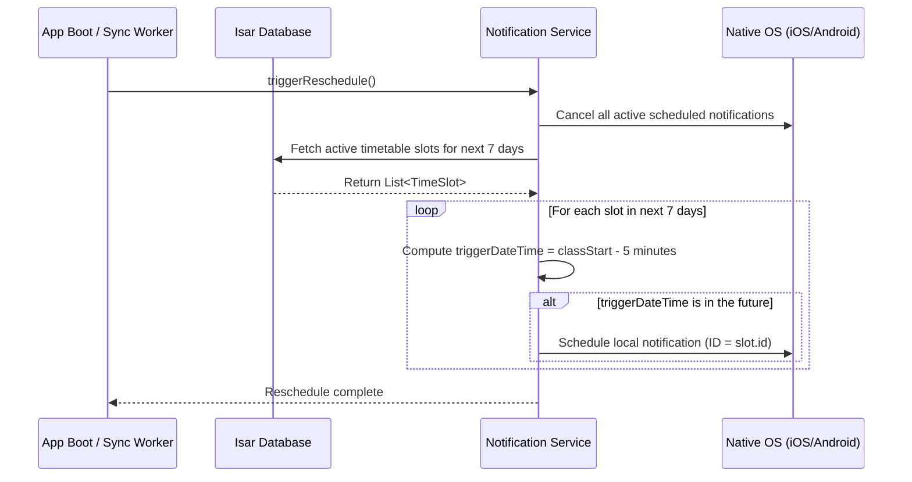

# Notification Service Architecture: AttendIQ

AttendIQ implements a hybrid notification system to deliver class check-in reminders and critical attendance alerts. This system combines **Local Scheduled Alerts** for time-sensitive classroom reminders and **Cloud Push Notifications** for server-triggered updates and metrics alerts.

---

## 1. Architecture Overview

The notification subsystem is managed by a unified `NotificationService` wrapper that coordinates the scheduling of local reminders and handles incoming push payloads.

```
                              [ NotificationService ]
                                         │
                 ┌───────────────────────┴───────────────────────┐
                 ▼ (Local)                                       ▼ (Remote)
  [ flutter_local_notifications ]                       [ firebase_messaging ]
                 │                                               │
                 ▼                                               ▼
       - Class start alerts                             - Server-triggered alerts
       - Bunk warning alerts                            - Global system updates
       - Rolling 7-day schedule                         - Sync completion status
```

---

## 2. Rolling Schedule Engine (Local Alerts)

To support complete offline functionality, class reminder alerts are scheduled locally on the device.

### 2.1 The OS Limitation Problem
Both Android and iOS restrict the maximum number of active scheduled notifications a single app can register:
*   **iOS**: Hard limit of **64** scheduled local notifications.
*   **Android**: Variable limits depending on device RAM and OEM overlays.

If a student has 5 classes a day, 5 days a week, a full semester would require scheduling hundreds of notifications, exceeding the OS limits and causing notifications to drop silently.

### 2.2 The Rolling Window Solution
To circumvent this constraint, AttendIQ utilizes a **7-Day Rolling Scheduling Window**.



1.  **Cancel Stage**: The `NotificationService` cancels all currently scheduled local notifications to clear stale alerts.
2.  **Fetch Stage**: Queries Isar for all `TimeSlot` events occurring in the interval `[Today, Today + 7 days]`.
3.  **Schedule Stage**: Iterates over the slots. For each slot, it schedules a local notification with trigger time set to **5 minutes before class starts**.
4.  **Recurrence**: The rescheduling process is triggered on:
    *   App startup.
    *   Modifications to the weekly timetable template.
    *   Background sync cycles (Workmanager executions).

---

## 3. Remote Notifications (Firebase Cloud Messaging)

Cloud push notifications are utilized for server-side events that do not rely on local schedules.

*   **Token Registration**: On auth state changes, the device registers its FCM token to the `/users/{userId}/fcmTokens` node in Firestore.
*   **Data Messages**: We prioritize data-only messages (silent notifications) when triggering background sync actions from the console, letting the app download updates before alerting the student.
*   **System Alerts**: Used to alert students about global schedule changes or target updates.

---

## 4. Specific Notification Profiles

### 4.1 Before-Class Check-In Reminder
*   **Timing**: 5 minutes before class start.
*   **Payload**: `{"click_action": "FLUTTER_NOTIFICATION_CLICK", "route": "/dashboard", "subjectId": "123"}`
*   **Action**: Tapping the notification launches the app directly into the Today view, prompting the user to swipe Present or Absent.

### 4.2 Bunk Warning Alert
*   **Timing**: Triggered when a logging transaction results in a subject's percentage dropping within 2.5% of the target threshold (e.g. falls to 76.5% when target is 75%).
*   **Notification Text**: `"Warning: Math IV is close to falling below your 75% target. If you miss your next class, you will be ineligible for exams."`

### 4.3 Weekly Sunday Digest
*   **Timing**: Sunday at 6:00 PM local time.
*   **Action**: Background worker computes attendance statistics for the week and displays a summary alert summarizing total classes logged, active percentage, and bunk safety margins.
