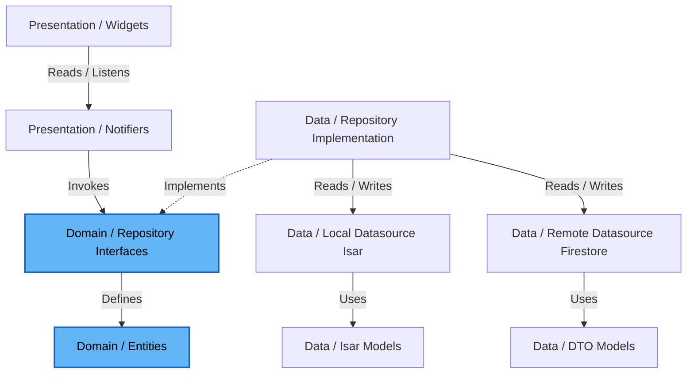

# AttendIQ 🎓🤖

Smart Offline-First Attendance Planner & Academic Advisor for College Students.

AttendIQ is a premium, cross-platform mobile application built with Flutter that empowers students to manage their timetables, track class attendance, analyze real-time eligibility margins, and receive AI-guided academic prioritization recommendations. By combining offline-first local persistence with seamless cloud synchronization, AttendIQ ensures student records are always accessible and secure.

---

## 📌 Problem Statement

College students often face strict academic regulations requiring a minimum attendance percentage (typically 75% or 80%) to qualify for exams. Keeping track of daily schedules, calculating safe bunk counts, and anticipating attendance dips is a tedious, error-prone manual task. Failing to meet these thresholds can lead to severe academic and administrative penalties.

AttendIQ solves this by acting as an intelligent scheduling assistant. It automates timetable event generation, delivers predictive and reactive calculators (detailing how many classes can be safely missed or must be attended), and provides personalized, AI-driven study and attendance suggestions to keep students on track.

---

## 🎨 Screenshots Showcase

Below are the mockups and screenshots showing the AttendIQ user interface.
*(Note: If screenshots are not showing, please add actual png assets to the `screenshots/` directory).*

| Dashboard | Smart Attendance | Analytics Dashboard | AI Academic Advisor |
| :---: | :---: | :---: | :---: |
|  |  |  |  |

> [!NOTE]
> To update these visual showcases, place your high-resolution app screenshots in the `/screenshots` directory under the filenames `dashboard.png`, `attendance.png`, `analytics.png`, and `ai_assistant.png`.

---

## ✨ Features Showcase

### 🔐 Authentication & Onboarding
*   **Flexible Logins**: Secure authentication via email/password or single-tap Google Sign-In (OAuth).
*   **Instant Access**: Cached auth sessions bypass remote backend calls on startup, launching the app instantly even without cell service.

### 📅 Smart Attendance Logging
*   **Granular Status Options**: Track classes as *Present*, *Absent*, *Late*, *Cancelled*, *Extra Present*, or *Extra Absent*.
*   **Intuitive Gestures**: Swipe right for present and left for absent directly on the home screen carousel.
*   **Detailed Calendar View**: Review and edit logs retroactively by selecting dates on the calendar.

### 🗓️ Timetable Planner
*   **Weekly Grid Layout**: Plan repeating weekly schedules with custom start and end times.
*   **Collision Detection**: Real-time validation warns you if a new class slot overlaps with an existing scheduled class.

### 📊 Attendance Analytics
*   **Real-time Metrics**: Dynamic indicators displaying overall and subject-specific attendance percentages.
*   **Safe Bunk Predictor**: Mathematical calculation of how many upcoming classes can be safely missed without falling below the target.
*   **Catch-up Estimator**: Accurate counts of how many consecutive classes must be attended to restore target levels.

### 🔔 Smart Notifications
*   **Class Reminders**: Pre-class alerts reminding you to attend upcoming slots.
*   **Rolling 7-day Queue**: Custom scheduler updating local notifications in the background to work around OS constraints.
*   **Low Attendance Warnings**: Push alerts when a subject's rate falls below the designated threshold.

### 🤖 AI Academic Advisor
*   **Gemini AI Recommendations**: Analyzes your weekly timetable and attendance records to draft academic strategies.
*   **Local Rule Engine Fallback**: Rule-based heuristic suggestions display immediately if the device is offline.

### 📈 Reports & Exports
*   **Historical Digests**: Comprehensive summaries of semester-long attendance patterns.
*   **CSV/PDF Exports**: Generate clean logs of your records suitable for academic reviews or sharing.

---

## 🏗️ Technical Architecture

AttendIQ strictly follows **Clean Architecture** combined with a **Feature-First** structure to maintain separate, decoupled boundaries between components.



### Development Principles
1.  **Dependency Inversion**: Outer layers (Data, Frameworks, UI) depend on the inner core (Domain). The Domain depends on nothing.
2.  **Single Source of Truth**: UI listens to streams from the local database (Isar). Writing data automatically updates local streams, creating a highly responsive interface.
3.  **ACID Compliance**: Local changes are registered inside transactional scopes and scheduled in an outbox queue to be synced when internet connectivity is active.

### Technical Documentation Index
Please refer to the following documentation files for detailed architecture, design, and code specifications:

| Document | Purpose |
|---|---|
| 📑 [PROJECT.md](file:///c:/Users/ramsa/Desktop/AttendIQ/docs/PROJECT.md) | Product vision, target personas, core business rules, and mathematical formulas. |
| 🏗️ [ARCHITECTURE.md](file:///c:/Users/ramsa/Desktop/AttendIQ/docs/ARCHITECTURE.md) | Clean Architecture + Feature-First structure and data flow details. |
| ⚙️ [ATTENDANCE_ENGINE.md](file:///c:/Users/ramsa/Desktop/AttendIQ/docs/ATTENDANCE_ENGINE.md) | Calculations logic, timetable-to-event generation mechanics, and state flow. |
| 🔔 [NOTIFICATION_SERVICE.md](file:///c:/Users/ramsa/Desktop/AttendIQ/docs/NOTIFICATION_SERVICE.md) | Local reminders, rolling 7-day queue architecture, and FCM integrations. |
| 🗃️ [DATABASE.md](file:///c:/Users/ramsa/Desktop/AttendIQ/docs/DATABASE.md) | Local Isar database schemas and remote Cloud Firestore collections. |
| 🛡️ [FIREBASE_SECURITY.md](file:///c:/Users/ramsa/Desktop/AttendIQ/docs/FIREBASE_SECURITY.md) | Security rules (`firestore.rules` structure), data isolation, and backup strategy. |
| 🎯 [FEATURES.md](file:///c:/Users/ramsa/Desktop/AttendIQ/docs/FEATURES.md) | Functional spec detailing onboarding, timetable, logger, and calculators. |
| 🎨 [UI_GUIDE.md](file:///c:/Users/ramsa/Desktop/AttendIQ/docs/UI_GUIDE.md) | HSL color system, typography sheets, screen mockups, and gestures. |
| 🛠️ [TECH_STACK.md](file:///c:/Users/ramsa/Desktop/AttendIQ/docs/TECH_STACK.md) | Core dependencies, Flutter/Dart SDK requirements, and pubspec configuration. |
| 🏃‍♂️ [DEVELOPMENT.md](file:///c:/Users/ramsa/Desktop/AttendIQ/docs/DEVELOPMENT.md) | Local runner instructions, environment flavors, lint validations, and Git rules. |
| 📐 [CODING_RULES.md](file:///c:/Users/ramsa/Desktop/AttendIQ/docs/CODING_RULES.md) | Directory layers code rules, Riverpod generators guidelines, and Isar transaction policies. |
| 🧪 [TESTING.md](file:///c:/Users/ramsa/Desktop/AttendIQ/docs/TESTING.md) | Mathematical calculators coverage unit tests, Mocktail mocks, and widget test templates. |
| 🗺️ [ROADMAP.md](file:///c:/Users/ramsa/Desktop/AttendIQ/docs/ROADMAP.md) | Detailed 5-phase schedule detailing feature ordering and deliverables. |
| 🧠 [AI_AGENT.md](file:///c:/Users/ramsa/Desktop/AttendIQ/docs/AI_AGENT.md) | Gemini integration prompt layouts, JSON schemas, and offline local heuristics. |
| 📋 [TASKS.md](file:///c:/Users/ramsa/Desktop/AttendIQ/docs/TASKS.md) | Comprehensive task backlog with prioritizations and completion criteria. |
| 📝 [DECISIONS.md](file:///c:/Users/ramsa/Desktop/AttendIQ/docs/DECISIONS.md) | Architectural Decision Records (ADRs) explaining tech stack choices. |
| ⚖️ [DOMAIN_RULES.md](file:///c:/Users/ramsa/Desktop/AttendIQ/docs/DOMAIN_RULES.md) | Domain business rules independent of storage, framework, or backend. |
| 🔄 [SYNC_ENGINE.md](file:///c:/Users/ramsa/Desktop/AttendIQ/docs/SYNC_ENGINE.md) | Offline-first database outbox sync queue and conflict resolution mechanics. |
| 📂 [FOLDER_STRUCTURE.md](file:///c:/Users/ramsa/Desktop/AttendIQ/docs/FOLDER_STRUCTURE.md) | Standardized Clean Architecture, Feature-First Flutter folder structure. |
| 🎯 [MVP_SCOPE.md](file:///c:/Users/ramsa/Desktop/AttendIQ/docs/MVP_SCOPE.md) | Target boundaries, in-scope features, exclusions, and release criteria. |
| 🚀 [CI_CD.md](file:///c:/Users/ramsa/Desktop/AttendIQ/docs/CI_CD.md) | Git branching, conventional commits, code reviews, and GitHub Actions CI. |
| 📋 [RELEASE_CHECKLIST.md](file:///c:/Users/ramsa/Desktop/AttendIQ/docs/RELEASE_CHECKLIST.md) | Full verification and compilation guidelines for app store releases. |

---

## ⚙️ Installation & Setup

### Requirements
*   **Flutter SDK**: `>= 3.22.0` (stable channel)
*   **Dart SDK**: `>= 3.4.0 < 4.0.0`
*   **Android Development**: Android Studio, Android SDK Platform 34, Min SDK 21
*   **iOS Development**: Xcode `>= 15.0`, CocoaPods (for iOS deployment only)

### Flutter & Project Setup
1.  **Clone the Repository**:
    ```bash
    git clone https://github.com/ramsaitanguturi/AttendIQ.git
    cd AttendIQ
    ```
2.  **Get Dependencies**:
    ```bash
    flutter pub get
    ```
3.  **Run Code Generation**:
    Build code components for Riverpod annotation and Isar schema bindings:
    ```bash
    dart run build_runner build --delete-conflicting-outputs
    ```

### Firebase Setup
1.  Create a project on the [Firebase Console](https://console.firebase.google.com/).
2.  Add Android and iOS applications with the bundle identifier `com.ramsa.attendiq.attend_iq`.
3.  Download and configure layout files:
    *   Place `google-services.json` in `android/app/`.
    *   Place `GoogleService-Info.plist` in `ios/Runner/`.
4.  Enable **Firestore Database** and **Firebase Authentication** (Email/Password & Google Sign-In) in your Firebase project.

### Environment & Run Configuration
Add the Gemini API key during compilation. Create a `.env` file or pass it directly to compilation commands:

```bash
# Run in debug mode on a connected emulator
flutter run --dart-define=GEMINI_API_KEY="YOUR_GEMINI_API_KEY"

# Build Android release APK
flutter build apk --dart-define=GEMINI_API_KEY="YOUR_GEMINI_API_KEY" --release
```

---

## 🤝 Contribution Guidelines

We welcome contributions to AttendIQ! Please follow these standards:

1.  **Branching Strategy**:
    *   Feature development: `feature/<feature-name>` branched off `development`.
    *   Bug fixes: `bugfix/<issue-name>` branched off `development`.
    *   All merges target `development` first. Merges to `main` are reserved for verified releases.
2.  **Commit Message Format**:
    Use Conventional Commits: `type(scope): description` (e.g., `feat(analytics): calculate consecutive classes needed`).
3.  **Pull Requests**:
    *   Ensure all unit tests pass: `flutter test`
    *   Verify static analysis is clean: `flutter analyze`
    *   Run `dart format . --set-exit-if-changed` before submitting.

---

## ⚖️ License

Private repository. All rights reserved. Developed by [Ram Sai](https://github.com/ramsaitanguturi).
