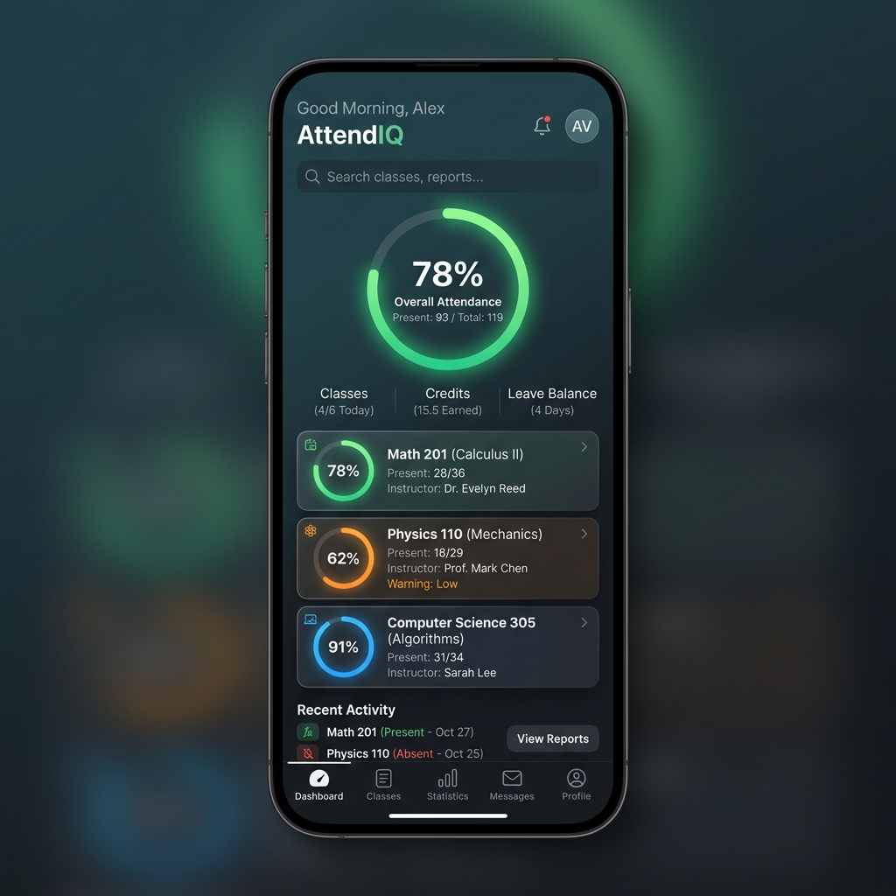
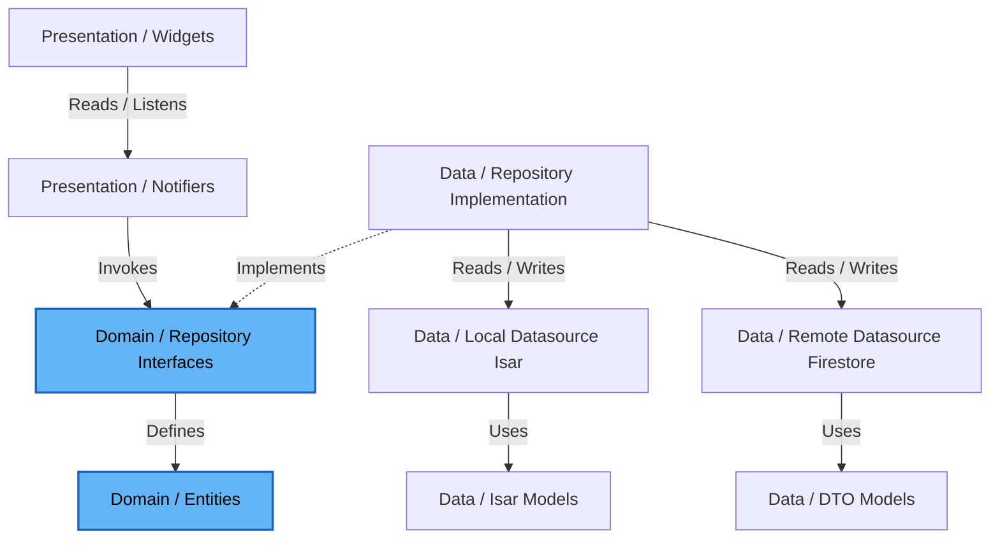

# AttendIQ

Smart Attendance Planner for College Students.

AttendIQ is a cross-platform mobile application built with Flutter that helps students manage their semester timetable, track attendance, calculate safe bunks, receive reminders, and securely synchronize their data across devices.

---

## Showcase



### Core Features

- **Smart Attendance Logging**: Easily log attendance with status options: *Present*, *Absent*, *Late*, *Cancelled*, *Extra Present*, and *Extra Absent*.
- **Offline-First Synchronization**: Changes are registered instantly in a local ACID-compliant database (Isar) and enqueued in an Outbox sync queue. Bidirectional syncing with Cloud Firestore happens silently in the background when network connectivity is restored (Last-Write-Wins logic).
- **Attendance Analytics & Forecasting**: Real-time calculators for current attendance rates, safe bunk margins, and required catch-up class streaks, conforming strictly to domain constraints.
- **Dynamic Notifications**: Rolling 7-day scheduled reminders (to bypass OS limits), pre-class notifications, and weekly email digests.
- **AI Academic Advisor**: Packaged student context analyzed by Gemini to generate academic prioritization advice, fallback to rule-based offline diagnostics when offline.

---

## Technical Architecture

AttendIQ strictly follows **Clean Architecture** combined with a **Feature-First** structure to maintain separate, decoupled boundaries between components.



---

## Technical Documentation Index

Please refer to the following documentation files for detailed architecture, design, and code specifications:

| Document | Purpose |
|---|---|
| 📑 [PROJECT.md](file:///c:/Users/ramsa/Desktop/AttendIQ/docs/PROJECT.md) | Product vision, target personas, core business rules, and mathematical formulas. |
| 🏗️ [ARCHITECTURE.md](file:///c:/Users/ramsa/Desktop/AttendIQ/docs/ARCHITECTURE.md) | Clean Architecture + Feature-First structure and data flow details. |
| ⚙️ [ATTENDANCE_ENGINE.md](file:///c:/Users/ramsa/Desktop/AttendIQ/docs/ATTENDANCE_ENGINE.md) | Calculations logic, timetable-to-event generation mechanics, and state flow. |
| 🔔 [NOTIFICATION_SERVICE.md](file:///c:/Users/ramsa/Desktop/AttendIQ/docs/NOTIFICATION_SERVICE.md) | Local reminders, rolling 7-day queue architecture, and FCM integrations. |
| 🗃️ [DATABASE.md](file:///c:/Users/ramsa/Desktop/AttendIQ/docs/DATABASE.md) | Local Isar database schemas and remote Cloud Firestore collections. |
| 🛡️ [FIREBASE_SECURITY.md](file:///c:/Users/ramsa/Desktop/AttendIQ/docs/FIREBASE_SECURITY.md) | Security rules (`firestore.rules` structure), data isolation, and backup strategy. |
| 🎯 [FEATURES.md](file:///c:/Users/ramsa/Desktop/AttendIQ/docs/FEATURES.md) | Functional spec detailing onboarding, timetable, logger, and calculators. |
| 🎨 [UI_GUIDE.md](file:///c:/Users/ramsa/Desktop/AttendIQ/docs/UI_GUIDE.md) | HSL color system, typography sheets, screen mockups, and gestures. |
| 🛠️ [TECH_STACK.md](file:///c:/Users/ramsa/Desktop/AttendIQ/docs/TECH_STACK.md) | Core dependencies, Flutter/Dart SDK requirements, and pubspec configuration. |
| 🏃‍♂️ [DEVELOPMENT.md](file:///c:/Users/ramsa/Desktop/AttendIQ/docs/DEVELOPMENT.md) | Local runner instructions, environment flavors, lint validations, and Git rules. |
| 📐 [CODING_RULES.md](file:///c:/Users/ramsa/Desktop/AttendIQ/docs/CODING_RULES.md) | Directory layers code rules, Riverpod generators guidelines, and Isar transaction policies. |
| 🧪 [TESTING.md](file:///c:/Users/ramsa/Desktop/AttendIQ/docs/TESTING.md) | Mathematical calculators coverage unit tests, Mocktail mocks, and widget test templates. |
| 🗺️ [ROADMAP.md](file:///c:/Users/ramsa/Desktop/AttendIQ/docs/ROADMAP.md) | Detailed 5-phase schedule detailing feature ordering and deliverables. |
| 🧠 [AI_AGENT.md](file:///c:/Users/ramsa/Desktop/AttendIQ/docs/AI_AGENT.md) | Gemini integration prompt layouts, JSON schemas, and offline local heuristics. |
| 📋 [TASKS.md](file:///c:/Users/ramsa/Desktop/AttendIQ/docs/TASKS.md) | Comprehensive task backlog with prioritizations and completion criteria. |
| 📝 [DECISIONS.md](file:///c:/Users/ramsa/Desktop/AttendIQ/docs/DECISIONS.md) | Architectural Decision Records (ADRs) explaining tech stack choices. |
| ⚖️ [DOMAIN_RULES.md](file:///c:/Users/ramsa/Desktop/AttendIQ/docs/DOMAIN_RULES.md) | Domain business rules independent of storage, framework, or backend. |
| 🔄 [SYNC_ENGINE.md](file:///c:/Users/ramsa/Desktop/AttendIQ/docs/SYNC_ENGINE.md) | Offline-first database outbox sync queue and conflict resolution mechanics. |
| 📂 [FOLDER_STRUCTURE.md](file:///c:/Users/ramsa/Desktop/AttendIQ/docs/FOLDER_STRUCTURE.md) | Standardized Clean Architecture, Feature-First Flutter folder structure. |
| 🎯 [MVP_SCOPE.md](file:///c:/Users/ramsa/Desktop/AttendIQ/docs/MVP_SCOPE.md) | Target boundaries, in-scope features, exclusions, and release criteria. |
| 🚀 [CI_CD.md](file:///c:/Users/ramsa/Desktop/AttendIQ/docs/CI_CD.md) | Git branching, conventional commits, code reviews, and GitHub Actions CI. |
| 📋 [RELEASE_CHECKLIST.md](file:///c:/Users/ramsa/Desktop/AttendIQ/docs/RELEASE_CHECKLIST.md) | Full verification and compilation guidelines for app store releases. |

---

## Installation & Setup

### Prerequisites

1. Install the [Flutter SDK](https://flutter.dev/docs/get-started/install) (stable channel, version `3.22.0` or higher).
2. Set up Android Studio, VS Code, or Xcode with Dart/Flutter plugins.
3. Configure target device emulator.

### Build Instructions

1. **Clone the repository**:
   ```bash
   git clone <repository_url>
   cd AttendIQ
   ```

2. **Retrieve Dependencies**:
   ```bash
   flutter pub get
   ```

3. **Generate Riverpod and Isar bindings**:
   ```bash
   dart run build_runner build --delete-conflicting-outputs
   ```

4. **Add Generative AI API Key**:
   Gemini API Key is provided as a compile-time string mapping variable named `GEMINI_API_KEY`:
   - Add your key during execution as follows:
     ```bash
     flutter run --dart-define=GEMINI_API_KEY="YOUR_API_KEY_HERE"
     ```

5. **Compile Staging Flavor APK**:
   ```bash
   flutter build apk --flavor dev -t lib/main_development.dart --release
   ```

---

## Author

Ram Sai
