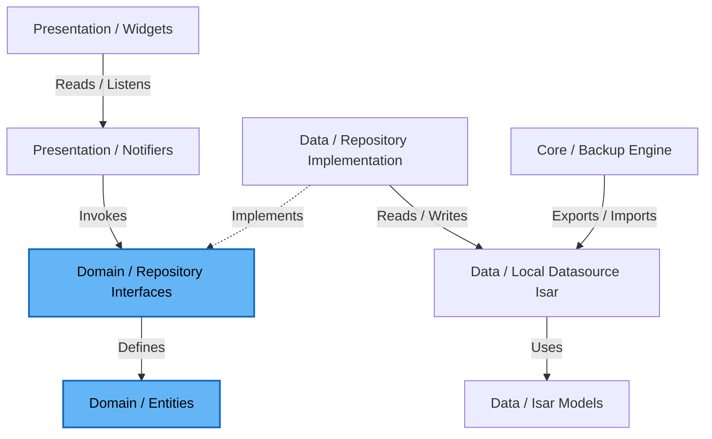

# Technical Architecture: AttendIQ

AttendIQ is structured as a 100% offline Clean Architecture application organized in a Feature-First directory layout. It uses Riverpod for state management and dependency injection, and incorporates an internal Backup & Restore engine (`.attendiq`) for user data portability without cloud servers or accounts.

---

## 1. Directory Structure

We use a **Feature-First** structure. Each directory in `lib/features/` represents a self-contained feature containing its own presentation, domain, and data layers. Shared infrastructure and utilities live in `lib/core/`.

```
lib/
├── core/                         # Shared core infrastructure
│   ├── database/                 # Isar DB provider and schema registration
│   ├── backup/                   # BackupExporter, BackupImporter, BackupService
│   ├── theme/                    # Color palettes, typography, theme notifier
│   ├── notifications/            # Local notification scheduler and services
│   ├── event_generator/          # Generator mapping timetable templates to events
│   ├── analytics/                # Calculated metrics and risk resolvers
│   ├── attendance_engine/        # Mathematical bunk & catch-up calculators
│   ├── reports/                  # PDF/CSV report generation service
│   ├── ai/                       # Local AI advisor & context builders
│   ├── widgets/                  # Reusable UI elements
│   ├── errors/                   # Failure classes, exceptions
│   └── utils/                    # Math formulas, UUID generators, Date extensions
│
├── features/                     # Feature directories
│   ├── semester/                 # Semester repository, entities, Isar models
│   ├── subject/                  # Subject CRUD, credit settings, targets
│   ├── attendance/               # Attendance logging (Present, Absent, Late)
│   ├── timetable/                # Weekly schedule, slots, collision checks
│   ├── analytics/                # Trends, forecasts, bunk calculator page
│   ├── backup/                   # Export & Import UI screens
│   ├── onboarding/               # First launch wizard & splash
│   ├── settings/                 # App settings, info, privacy
│   └── ai_assistant/             # Gemini AI assistant client & suggestions
│
└── main.dart                     # Application entry point
```

Within each **feature folder** (e.g., `lib/features/subject/`), Clean Architecture layers are strictly maintained:

```
subject/
├── data/
│   ├── datasources/             # Local (Isar) datasource
│   │   └── subject_local_data_source.dart
│   ├── models/                  # Isar schemas & JSON converters
│   │   └── subject_local.dart
│   └── repositories/            # Repository implementation mapping data to domain
│       └── subject_repository_impl.dart
│
├── domain/
│   ├── entities/                # Pure Dart business models
│   │   └── subject.dart
│   └── repositories/            # Interface definitions for repositories
│       └── subject_repository.dart
│
└── presentation/
    ├── controllers/             # Riverpod Notifiers managing UI state
    │   └── subject_controller.dart
    ├── pages/                   # Full screens
    └── widgets/                 # Feature-specific widgets
```

---

## 2. Layers & Dependency Rules

Following Clean Architecture principles, **dependencies must only point inward**:
- The **Presentation** layer depends on the **Domain** layer (to invoke business logic) and uses **Core** for UI blocks.
- The **Data** layer depends on the **Domain** layer (implementing Repository interfaces).
- The **Domain** layer is completely independent of other layers. It contains no references to Flutter packages, Isar, or network clients. It is pure Dart.



---

## 3. State Management & Data Flow

Riverpod is used as the application's reactive engine. 
- **Notifiers** read repository instances, call async methods, update state, and notify subscribers.
- **UI Widgets** consume Notifiers using `ref.watch()`.

### Standard Data Read Flow
1. Widget does `ref.watch(subjectListControllerProvider)`.
2. The controller gets the repository instance.
3. The repository queries Isar database locally.
4. The local models are converted into domain entities.
5. The list of entities is emitted as state (`AsyncData([Subject])`).

### Standard Write Flow (100% Offline)
1. User taps "Mark Present" on a class widget.
2. Widget calls `ref.read(attendanceControllerProvider.notifier).markAttendance(...)`.
3. The controller calls `attendanceRepository.saveAttendanceRecord(record)`.
4. The Repository writes the record into **Isar local database** inside an ACID transaction scope.
5. The user interface updates immediately via Isar's local watcher stream.

---

## 4. Backup & Restore Architecture (.attendiq)

AttendIQ user data is preserved entirely on the local device. Data portability is handled via an offline Backup & Restore system.

### 4.1 Backup Components
- **BackupMetadata**: Includes `appVersion`, `backupVersion`, `createdAt`, and `devicePlatform`.
- **BackupExporter**: Extracts data from all Isar collections (`UserPreferences`, `Semester`, `Subject`, `TimetableTemplate`, `AttendanceRecord`, `Event`, `NotificationItem`) into a structured JSON container.
- **BackupImporter**: Validates payload structure and `backupVersion`. Provides two restore strategies:
  - **Replace**: Clears existing local database collections before inserting imported records.
  - **Merge**: Integrates imported records alongside existing records without deleting existing collections.
- **BackupService**: Coordinates export file writing (`.attendiq` extension) and holds extension hooks for future AES payload encryption.
